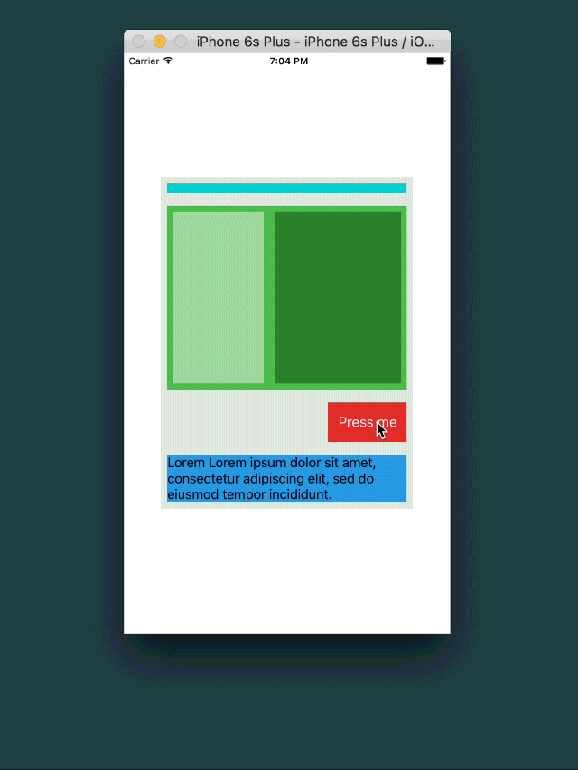

# FlexboxLayout
[](https://github.com/Carthage/Carthage)
[](#)
[](#)
[](https://opensource.org/licenses/MIT)

Port of Facebook's [css-layout](facebook css layout) to Swift + *UIView* extension.




This dynamic layout is expressed in code in the following declarative fashion:


```swift
     
let defaultMargin: Inset = (8.0, 8.0, 8.0, 8.0, 8.0, 8.0)

self.treeView = UIView().configure({ (view, style) in
   view.backgroundColor = UIColor.a
   style.minDimensions = (320, 420)
   style.flex = 1
   style.alignSelf = .Stretch
   
}, children: [
   
   UIView().configure({ (view, style) in
       style.flex = 1
       style.alignSelf = .Stretch
       style.flexDirection = .Column

   }, children: [
   
       UIView().configure({ (view, style) in
           view.backgroundColor = UIColor.b
           view.hidden = self.toggle
           style.minDimensions = (128, 44)
           style.justifyContent = .Center
           style.alignSelf = .Stretch
           style.margin = defaultMargin
       }),
       
       UIView().configure({ (view, style) in
           view.backgroundColor = UIColor.c
           style.minDimensions = (44,44)
           style.flexDirection = .Row
           style.flex = 1
           style.margin = defaultMargin

           }, children: [
               
               UIView().configure({ (view, style) in
                   view.backgroundColor = UIColor.d
                   style.flex = 0.4
                   style.margin = defaultMargin
               }),
               
               UIView().configure({ (view, style) in
                   view.backgroundColor = UIColor.e
                   style.flex = 0.6
                   style.margin = defaultMargin
               })
           ]),
       
       UIButton().configure({ (view, style) in
           view.backgroundColor = UIColor.f
           view.setTitle("Press me", forState: .Normal)
           style.minDimensions = (94,44)
           style.justifyContent = .FlexEnd
           style.alignSelf = .FlexEnd
           style.margin = defaultMargin
       })
       
   ]),
   
   UILabel().configure({ (label, style) -> Void in
       label.backgroundColor = UIColor.g
       label.numberOfLines = 0
       label.text = "Lorem Lorem ipsum..."
       style.margin = defaultMargin
   })
])

self.view.addSubview(self.treeView!)


```

Checkout the Demo project for further info.
