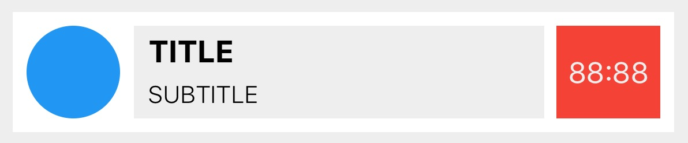

# FlexboxLayout
[](https://github.com/Carthage/Carthage)
[](#)
[](#)
[](https://opensource.org/licenses/MIT)

Port of Facebook's [css-layout](facebook css layout) to Swift + *UIView* extension.



TL;DR
This layout and style is expressed in code in the following declarative fashion:


```swift
 
let view = UIView().configure({
    $0.backgroundColor = UIColor.whiteColor()
    $0.style.justifyContent = .Center
    $0.style.alignSelf = .Stretch
    $0.style.flexDirection = .Row
    
    }, children: [
        
        UIView().configure({
            $0.backgroundColor = UIColor.blueColor()
            $0.layer.cornerRadius = 27.0
            $0.style.dimensions = (54, 54)
            $0.style.margin = defaultMargin
            $0.style.alignSelf = .Center
            $0.style.justifyContent = .FlexStart
        }),
        
        UIView().configure({
            $0.backgroundColor = UIColor.grayColor()
            $0.style.minDimensions = (100, 54)
            $0.style.alignSelf = .Center
            $0.style.flex = 0.8
            }, children: [
            
                UILabel().configure({
                    $0.text = "TITLE"
                    $0.style.alignSelf = .FlexStart
                    $0.style.margin = (0.0, 4.0, 0.0, 0.0, 8.0, 0.0)
                }),
                
                UILabel().configure({
                    $0.text = "SUBTITLE"
                    $0.style.alignSelf = .FlexStart
                    $0.style.margin = (0.0, 6.0, 0.0, 0.0, 8.0, 0.0)
                })
                
            ]),
        
        UILabel().configure({
            $0.backgroundColor = UIColor.redColor()
            $0.text = "88:88"
            $0.textColor = UIColor.a
            $0.textAlignment = .Center
            $0.style.minDimensions = (54, 54)
            $0.style.alignSelf = .Center
            $0.style.flex = 0.2
            $0.style.margin = defaultMargin
        })
    ])
})

view.render()

```

The  `configure` function stores the configuration closure for each view and these are recursively re-applied whenever the `render` function is called on the root view.

This allows you to have a React-inspired design of your view logic.


 
